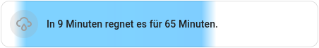

_DISCLAIMER: This project is a private open source project and doesn't have any connection with Deutscher Wetterdienst._

# DWD Precipitation Forecast

**DWD Precipitation Forecast** is a **Home Assistant** component which provides a detailed precipitation forecast for the **next two hours**.
The forecast is derived from the **DWD (Deutscher Wetterdienst) rain radar forecast**. _This integration only works in Germany!_

## Sensors

The integration proveds these sensors:

* **DWD Precipitation Forecast:** The current precipitation intensity (mm/h) at your location
  * This sensor also contains attributes with the forecasted precipitation over the next two hours, in 5-minute-steps 
* **Next Precipitation:** Information about the start, end, length and intensity of the next precipitation event
* **Precipitation in next 15/30/60min:** Will it rain in the next 15/30/60 minutes?

## Installation

### Home Assistant Community Store (HACS)

1. Open HACS in Home Assistant
2. Select `Custom Repositories`
3. Add `https://github.com/stoppegp/ha-dwd-precipitation-forecast`
4. Select `DWD Precipitation Forecast` and download it
5. Select `Integration` as type
6. Add a new device _DWD Precipitation Forecast_
7. Insert the location name, latitude and longitude

### Manual Installation

1. Download the latest release
2. Unpack the release and copy the `custom_components/dwd_precipitation_forecast` directory into  the `custom_components` directory of your Home Assistant installation
3. Restart Home Assistant
4. Add a new device _DWD Precipitation Forecast_
5. Insert the location name, latitude and longitude

## Precipitation forecast card

This is an example for a forecast card that you can create with data from this integration:



To create a forecast card like this, you need following components:

* [Mushroom Template card](https://github.com/piitaya/lovelace-mushroom)
* [easy-time-jinja](https://github.com/Petro31/easy-time-jinja)

Use this code for your dashboard:

```yaml
type: custom:mushroom-template-card
primary: >-
  

  

  

  In {{ custom_time(state_attr(entity, 'next_start'), 'hour, minute', 'de')
  }} regnet es für {{ state_attr(entity, 'next_length') }} Minuten.

  

  In {{ custom_time(state_attr(entity, 'next_start'), 'hour, minute', 'de')
  }} beginnt es zu regnen.

  

  Es regnet noch für {{ custom_time_between(now() | as_timestamp,
  state_attr(entity, 'next_end') | as_timestamp, 'hour, minute', None, None,
  'de') }}.

  

  Es regnet noch mindestens 2 Stunden lang.

  

  

  Kein Regen in den nächsten 2 Stunden.

  
icon: mdi:weather-rainy
icon_color: |-
  
  blue
  
  grey
  
entity: sensor.dwd_precipitation_forecast_leipzig
card_mod:
  style: |
    
    ha-card {
      background-image: linear-gradient(90deg, hsla({{hsl_h}}, 100%, {{hsl_l}}%, {{hsl_alpha}}) {{ max(pos,0) }}%);
    }

```

## Licenses

This package uses public data from [DWD OpenData](https://www.dwd.de/DE/leistungen/opendata/opendata.html). The Copyright can be viewed [here](https://www.dwd.de/DE/service/rechtliche_hinweise/rechtliche_hinweise.html).
